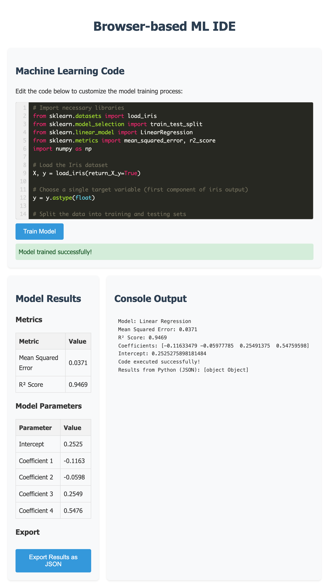

# ML Playground + Blog

A monorepo containing an interactive Machine Learning playground and narrative-driven blog.



## Project Structure

This project follows a monorepo structure:

- `apps/playground/`: Browser-based ML IDE that runs entirely in your browser using Pyodide
- `apps/site/`: Astro-based blog/docs site with MDX support and interactive examples

## Features

### Playground

- **100% Client-side Processing**: Run ML code without a server
- **Built-in ML Environment**: scikit-learn, numpy, and pandas via WebAssembly
- **Syntax Highlighting**: Python code editor with syntax highlighting
- **Real-time Results**: View metrics and model parameters

### Blog

- **Narrative-Driven Learning**: ML concepts explained as a continuous story
- **Interactive Examples**: Embedded Pyodide snippets you can run in the browser
- **Algorithm Visualizations**: Manim-powered animations to illustrate concepts
- **MDX Support**: Rich content mixing Markdown and interactive components

## Quick Start

```bash
# For playground only
cd apps/playground
./serve.sh

# For Astro site development
cd apps/site
npm install
npm run dev
```

## GitHub Pages Deployment

This project is designed to be compatible with GitHub Pages:

1. The Astro site is configured to build to the `/docs` directory
2. The playground is preserved at the root level for backward compatibility
3. All navigation and paths are designed to work with GitHub Pages URL structure

## Development Notes

- Be careful when modifying the Pyodide setup, as it requires specific structure to work correctly
- When working on the blog, test interactive components in both development and production builds
- GitHub Pages deployment will automatically serve from the `/docs` directory

## Prerequisites

- Modern web browser with WebAssembly support
- Node.js (for Astro site development)

---

*This project combines a browser-based ML playground with narrative-driven educational content, all running client-side with Pyodide.*
