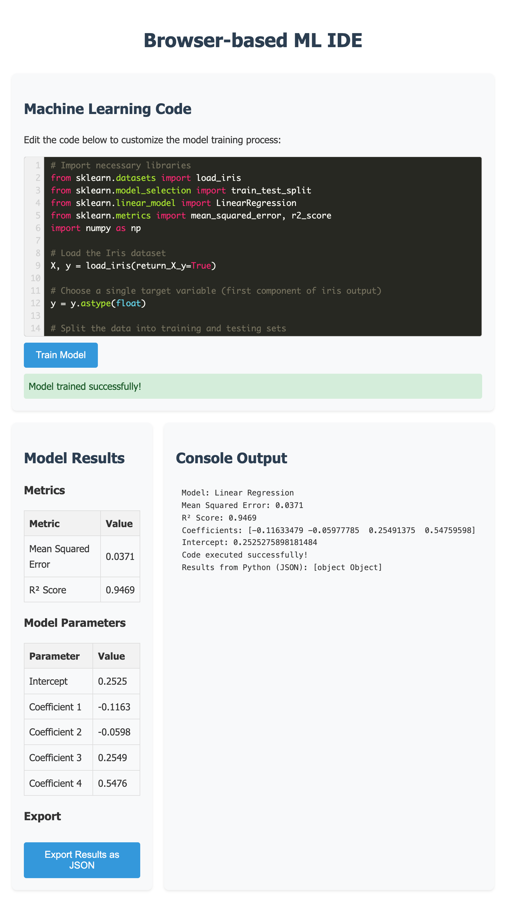

# Browser-based ML IDE

A client-side Machine Learning IDE that runs entirely in your browser using Pyodide to execute Python ML code with scikit-learn, numpy, and pandas.



## Features

- **100% Client-side Processing**: No server dependencies
- **Built-in ML Environment**: scikit-learn, numpy, and pandas via WebAssembly
- **Syntax Highlighting**: Python code editor with syntax highlighting
- **Real-time Results**: View metrics and model parameters
- **Export**: Download results as JSON

## Quick Start

```bash
./serve.sh  # For development only, enables CORS
```

Open your browser to http://localhost:8000

## How It Works

1. Loads Pyodide (Python via WebAssembly) in the browser
2. Imports scikit-learn, numpy, and pandas packages
3. Executes Python code directly in the browser
4. Displays results and metrics in the UI

## Project Structure

- `index.html`: Main HTML interface
- `styles.css`: CSS styling
- `script.js`: JavaScript for the application
- `serve.sh`: Local development server with CORS support (not for production)

## Prerequisites

- Modern web browser with WebAssembly support

## Troubleshooting

- Use a modern browser (Chrome, Firefox, Edge, Safari)
- Check console for errors
- Initial loading may take time as packages are downloaded
